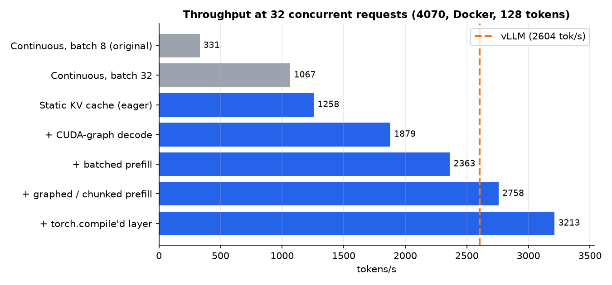
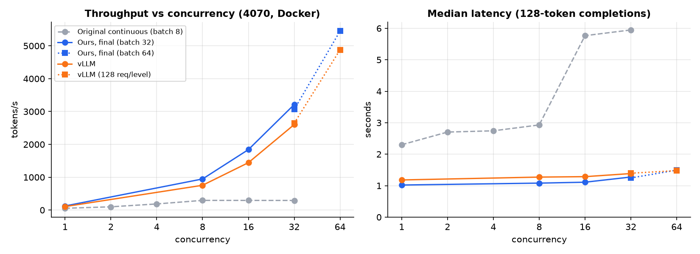

# LLM Inference Server

HuggingFace inference servers with a shared `POST /generate` API and a load-test harness for throughput/latency under concurrency.

Design notes and benchmark discussion: [WRITEUP.md](WRITEUP.md).

Default model: `Qwen/Qwen2.5-1.5B-Instruct` (fits a 12–16GB GPU). Override with `MODEL_NAME`.

## Setup

```bash
python -m venv venv
# Windows: venv\Scripts\activate
source venv/bin/activate

pip install torch --index-url https://download.pytorch.org/whl/cu128
pip install -r requirements.txt

python scripts/check_env.py --skip-vllm
```

vLLM does not import cleanly on this Windows setup (`vllm._C_stable_libtorch` missing); servers are PyTorch-native instead.

## Servers

| Server | Command | Behavior |
|--------|---------|----------|
| Naive | `uvicorn server.naive_server:app --host 0.0.0.0 --port 8000` | One request at a time (async lock around `.generate()`) |
| Static batch | `uvicorn server.static_batch_server:app --host 0.0.0.0 --port 8000` | Collect requests for up to 30ms / batch of 8 → one padded `generate()` |
| Continuous batch | `uvicorn server.continuous_batch_server:app --host 0.0.0.0 --port 8000` | Iteration-level scheduling on a GPU worker thread; in-place batched KV |
| Quantized continuous | `uvicorn server.quantized_server:app --host 0.0.0.0 --port 8000` | Same continuous scheduler with AWQ / BnB / GPTQ 4-bit weights |
| CUDA graph | `uvicorn server.cuda_graph_server:app --host 0.0.0.0 --port 8000` | Same scheduler; static slot-based KV cache, decode and short-prompt prefill replayed as CUDA graphs, long prompts prefilled in chunks between decode steps, decode layer `torch.compile`d when Triton is available (Llama-style models) |

| Knob | Default | Applies to |
|------|---------|------------|
| `MAX_BATCH_SIZE` | `32` | static, continuous, quantized, cuda-graph (results before the batch-size sweep used `8`) |
| `BATCH_TIMEOUT_MS` | `30` | static |
| `DECODE_BURST` | `64` | continuous, quantized |
| `TORCH_COMPILE` | `0` / `auto` | continuous, quantized (`0`); cuda-graph (`auto`: on when Triton and a C compiler exist, i.e. in Docker, off on Windows) |
| `CUDA_GRAPHS` | `1` | cuda-graph (`0` runs the same static-KV decode and prefill eagerly) |
| `PREFILL_CHUNK` | `512` | cuda-graph (longer prompts are prefilled in chunks of this size, one decode step between chunks) |
| `PREFILL_TOKEN_BUDGET` | `4096` | cuda-graph (max padded tokens per batched short-prompt prefill) |
| `MAX_SEQ_LEN` | `2048` | continuous, quantized |
| `QUANT_METHOD` | `bnb` | quantized (`bnb` \| `awq` \| `gptq`) |
| `MODEL_NAME` | (see below) | all |

Quantized defaults: `bnb` → base Instruct + NF4 (Windows-friendly); `awq` / `gptq` → pre-quantized HF checkpoints (typically Linux; `autoawq` needs Triton).

```powershell
pip install bitsandbytes
uvicorn server.quantized_server:app --host 0.0.0.0 --port 8000

# On Linux, AWQ checkpoint instead:
# pip install autoawq
# $env:QUANT_METHOD="awq"
# uvicorn server.quantized_server:app --host 0.0.0.0 --port 8000
```

### Docker

One image serves every server; pick one with `SERVER` (module name under `server/`). Requires the NVIDIA driver plus NVIDIA Container Toolkit (on Windows: Docker Desktop with the WSL2 backend).

```bash
docker build -t llm-inference-server .

# Continuous batching (default). The hf-cache volume keeps model downloads across runs.
docker run --gpus all -p 8000:8000 -v hf-cache:/models llm-inference-server

# Any other server / knob via env vars:
docker run --gpus all -p 8000:8000 -v hf-cache:/models \
  -e SERVER=quantized_server -e MODEL_NAME=Qwen/Qwen2.5-7B-Instruct \
  llm-inference-server
```

### GKE (L4 GPU)

`deploy/` holds PowerShell scripts plus manifests that stand up a small GKE cluster with one NVIDIA L4 node pool and benchmark servers on it.

Prerequisites:
- `gcloud` installed and logged in (`gcloud init`).
- The kubectl auth plugin: `gcloud components install gke-gcloud-auth-plugin`. On Windows, if gcloud refuses to update itself, first run `$env:CLOUDSDK_PYTHON = (gcloud components copy-bundled-python).Trim()`.
- A project with billing enabled. Free-trial accounts can't use GPUs until upgraded.
- GPU quota ≥ 1 for both **GPUs (all regions)** and **L4 GPUs** in the region (IAM → Quotas). New projects start the all-regions quota at 0.
- A budget alert set in Billing.

```powershell
.\deploy\setup.ps1              # APIs, Artifact Registry, image push, cluster + L4 Spot pool (-OnDemand for non-Spot)

.\deploy\bench.ps1 -Target server                                  # continuous (default)
.\deploy\bench.ps1 -Target server -Server static_batch_server
.\deploy\bench.ps1 -Target vllm
.\deploy\bench.ps1 -Target vllm -VllmArgs "--max-num-seqs 8" -Label vllm_seqs8

.\deploy\teardown.ps1           # delete the cluster; -DeleteImages also removes the registry repo
```

How the pieces fit:
- The GPU pool scales 0–1, so only one server runs at a time. `bench.ps1` deletes the other deployment before starting the new one.
- The load test runs from a pod inside the cluster, so the latencies include no internet hop.
- Each run writes two files: `results/gke_<label>.json` (uniform 128 tokens) and `results/gke_<label>_mixed.json`. The default is 100 requests per level; change it with `-Requests`. Our continuous server takes ~35 min at 100; vLLM at 50 takes a few minutes.
- The first deploy takes 10–15 min, covering GPU node scale-up, driver install, image pull and model load.
- Settings come from `deploy/config.ps1` and can be overridden with the env vars `GCP_PROJECT`, `GCP_REGION`, `GCP_ZONE` and `GKE_CLUSTER`.

Rough cost is about $0.30/hr for a Spot L4 (about $0.85 on-demand) plus a small CPU node. The cluster keeps billing until you run `teardown.ps1`.

### API

```bash
curl -X POST http://localhost:8000/generate \
  -H "Content-Type: application/json" \
  -d "{\"prompt\": \"Explain recursion in one paragraph.\", \"max_new_tokens\": 64}"
```

`GET /health` reports model and server-specific knobs.

## Benchmark

```bash
# Fixed completion length
python scripts/load_test.py \
  --url http://localhost:8000/generate \
  --concurrency 1 2 4 8 16 32 \
  --requests-per-level 20 \
  --out results/continuous_batch.json

# Mixed lengths (cycles 32 / 128 / 256 across requests)
python scripts/load_test.py \
  --url http://localhost:8000/generate \
  --concurrency 1 2 4 8 16 32 \
  --max-new-tokens 32 128 256 \
  --out results/continuous_mixed.json

# Quantized continuous (compare to continuous_batch.json)
python scripts/load_test.py \
  --url http://localhost:8000/generate \
  --concurrency 1 2 4 8 16 32 \
  --requests-per-level 20 \
  --out results/quantized_bnb.json

# vLLM baseline (Docker, port 8001) via its OpenAI-compatible API
docker run -d --name vllm --gpus all -p 8001:8000 --ipc=host \
  -v hf-cache:/root/.cache/huggingface vllm/vllm-openai:latest \
  --model Qwen/Qwen2.5-1.5B-Instruct --gpu-memory-utilization 0.75 --max-model-len 2048
python scripts/load_test.py --api openai \
  --url http://localhost:8001/v1/completions \
  --concurrency 1 2 4 8 16 32 \
  --out results/vllm_docker.json

# Long prompts: every 8th request carries a ~1500-token prompt (unique per request, so
# prefix caching can't help); short requests' latency is reported separately
python scripts/load_test.py \
  --url http://localhost:8000/generate \
  --concurrency 16 32 --requests-per-level 64 \
  --long-prompt-every 8 --long-prompt-words 1100 \
  --out results/long_prompts_chunk512.json
```

## Results

| File | Server / notes |
|------|----------------|
| `results/naive_baseline.json` | Naive, fixed 128 tokens |
| `results/static_batch.json` | Static, fixed 128 |
| `results/continuous_batch.json` | Continuous fp16 1.5B, fixed 128 |
| `results/static_mixed.json` | Static, mixed 32/128/256 |
| `results/continuous_mixed.json` | Continuous fp16 1.5B, mixed 32/128/256 |
| `results/quantized_bnb.json` | Continuous BnB NF4 1.5B, fixed 128 |
| `results/quantized_bnb_7b.json` | Continuous BnB NF4 7B, fixed 128 (c≤16) |
| `results/continuous_docker.json` | Continuous fp16 1.5B in Docker, fixed 128 |
| `results/continuous_docker_mixed.json` | Continuous fp16 1.5B in Docker, mixed 32/128/256 |
| `results/vllm_docker.json` | vLLM (default), fixed 128 |
| `results/vllm_docker_mixed.json` | vLLM (default), mixed 32/128/256 |
| `results/vllm_docker_seqs8.json` | vLLM `--max-num-seqs 8`, fixed 128 |
| `results/vllm_docker_seqs8_mixed.json` | vLLM `--max-num-seqs 8`, mixed 32/128/256 |
| `results/sweep_bs{8,16,32,64}.json` | Continuous in Docker, `MAX_BATCH_SIZE` sweep (c=8–64, 64–128 req/level) |
| `results/cuda_graph_bs32.json` / `_mixed` | CUDA-graph server, batch 32, Docker (64 req/level) |
| `results/cuda_graph_bs64.json` | CUDA-graph server, batch 64, c=32/64 (128 req/level) |
| `results/static_eager_bs32.json` | Static KV cache without graphs (`CUDA_GRAPHS=0`), batch 32 |
| `results/batched_prefill_bs32.json` / `_mixed`, `batched_prefill_bs64.json` | CUDA-graph server with batched (eager, HF) prefill |
| `results/chunked_prefill_bs32.json` / `_mixed`, `chunked_prefill_bs64.json` | + graphed short-prompt prefill and chunked long prompts, no `torch.compile` |
| `results/compiled_bs32.json` / `_mixed`, `compiled_bs64.json` | + `torch.compile`d decode layer (current version, Docker default) |
| `results/vllm_docker_64.json` / `_mixed`, `vllm_docker_128.json` | vLLM re-run with matching request counts (64 / 128 per level) |
| `results/long_prompts_chunk{512,2048}.json` | Current server, every 8th prompt ~1500 tokens, chunked (512) vs whole-prompt (2048) prefill |
| `results/vllm_docker_long_prompts.json` | vLLM on the same long-prompt workload |
| `results/gke_continuous_batch.json` / `_mixed` | Continuous fp16 1.5B on GKE L4 (100 req/level) |
| `results/gke_vllm.json` / `_mixed` | vLLM (default) on GKE L4 (50 req/level) |
| `results/gke_vllm_seqs8.json` / `_mixed` | vLLM `--max-num-seqs 8` on GKE L4 (50 req/level) |

Rows above the Docker entries ran natively on Windows on the 4070. Docker rows ran on the same GPU via WSL2. `gke_*` rows ran on one NVIDIA L4 on GKE.





Charts are generated from `results/` by `python scripts/plot_results.py` (needs `pip install matplotlib`); all of them are in `docs/img/` and embedded in [WRITEUP.md](WRITEUP.md).

**Headline findings (4070):**
- Naive throughput stays ~flat (~0.37 req/s) while p99 climbs with concurrency.
- Static batching raises peak throughput to ~2.3 req/s on uniform 1.5B fp16.
- Continuous matches/beats static around moderate concurrency on uniform load, and **clearly wins on mixed lengths** (~1.8–1.9× static req/s, much lower p50).
- BnB 4-bit on 1.5B cuts weight VRAM (~1.1 vs ~3 GiB) but is ~30% slower than fp16 continuous.
- BnB enables **Qwen2.5-7B-Instruct** on the same 12 GB card (~5.3 GiB load, ~1.1 req/s peak) — the real quantization win.
- In Docker, continuous holds ~2.3 req/s flat past c=8 (Windows sagged to ~1.6).
- vLLM is ~2.3× faster at the same batch cap of 8, and reaches ~15 req/s at c=32 uncapped.
- On a GKE L4 (original continuous server; the Phase 6 server wasn't redeployed), vLLM leads by ~3.7× at the same batch cap and ~10× uncapped (12.8 vs 1.26 req/s at c=32). Our server slowed ~2× vs the 4070 while vLLM slowed ~1.4×, which points to CPU and kernel-launch overhead as its bottleneck.
- Confirmed by a batch-size sweep: `MAX_BATCH_SIZE=32` gives 3.2× the throughput of 8 at c=32 (8.3 vs 2.6 req/s, p50 12.4s → 3.9s). At batch 64 and c=64 it reaches 12.7 req/s (1625 tok/s).
- **Static KV cache + CUDA graphs** (`cuda_graph_server`): decode step 29 ms → 11 ms at batch 32, with token-exact output vs HF `generate()`. At c=32: 14.7 req/s (1879 tok/s, p50 2.2s) vs vLLM's 22.5 (2604 tok/s), a ~1.4× gap in tok/s, down from ~7.9× for the original server. At c=1: 1.23s vs vLLM's 1.18s.
- **+ Batched prefill:** at c=32, 18.5 req/s (2363 tok/s, p50 1.8s). At batch 64 / c=64, 34.1 req/s (4359 tok/s) vs vLLM's 4880. That's within 4–12% of vLLM in tokens/s, and 7.1× the original continuous server at c=32.
- **+ Graphed prefill, chunked long prompts, compiled decode layer:** short-prompt prefill 33 → 10 ms, decode step −12–16%. At c=32: 3213 tok/s (p50 1.27s) vs vLLM's 2604 (1.38s); at batch 64 / c=64: 5450 vs 4880; mixed c=32: 2180 vs 1866; c=1 p50 1.02s vs 1.18s. **Ahead of vLLM on these short-prompt workloads**, and 9.7× the original server at c=32.
- **Long prompts are where vLLM still wins:** with every 8th prompt ~1500 tokens, vLLM does ~2110 tok/s at c=32 vs our ~1395. Chunking helps a little (vs whole-prompt prefill), but our decode attention reads every row up to the longest sequence's length, and vLLM's paged kernels don't.
