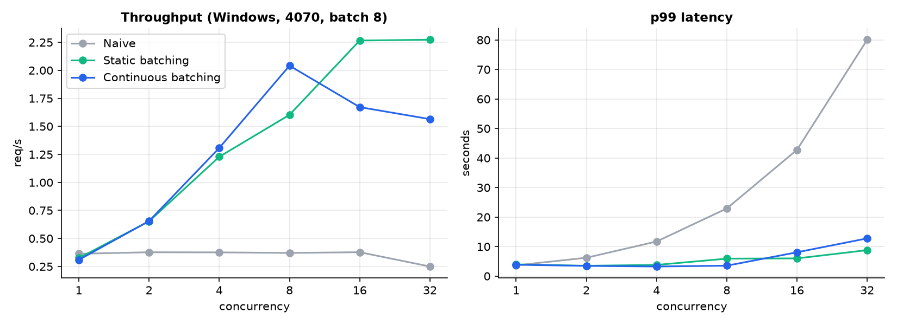
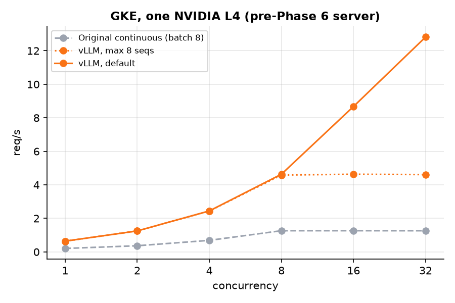
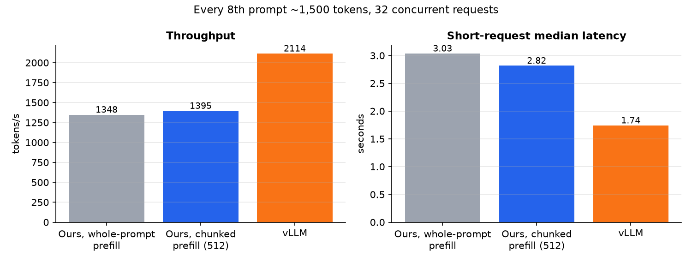

# Writeup: Building an LLM Inference Server

This project implements and benchmarks serving strategies for HuggingFace
causal LMs behind a shared FastAPI `POST /generate` API:

1. **Naive** — one request at a time  
2. **Static batching** — fixed batch for a whole `generate()` call  
3. **Continuous batching** — iteration-level scheduling with in-place KV  
4. **Quantized continuous** — same continuous scheduler with 4-bit weights (BnB NF4)
5. **Containerized + vLLM baseline** — the servers in Docker, benchmarked against
   vLLM locally and on GKE (NVIDIA L4)
6. **Static KV cache + CUDA graphs + batched/chunked prefill + `torch.compile`** —
   fixed-shape decode and prefill captured as CUDA graphs, long prompts chunked
   between decode steps, the decode layer compiled; ahead of vLLM in tokens/s on
   short-prompt workloads, behind it (~1.5×) when long prompts are mixed in

Hardware: NVIDIA RTX 4070 (12 GB) locally; one NVIDIA L4 (24 GB, `g2-standard-8`)
on GKE. Primary model: `Qwen/Qwen2.5-1.5B-Instruct` (fp16), plus BnB runs on 1.5B
and `Qwen/Qwen2.5-7B-Instruct`.  
Load test: `scripts/load_test.py` at concurrency `{1,2,4,8,16,32}` (7B up to 16).
Phases 1–4 and the first Phase 5 runs used 20 requests per level; GKE used 50–100;
the batch-size sweep and Phase 6 used 64–128 (vLLM re-run to match).
Phases 1–4 ran natively on Windows; Phases 5–6 ran in Docker (WSL2) on the 4070, plus GKE.

Raw JSON: `results/`. How to run: [README.md](README.md).

---

## Motivation

Serving LLMs is less about “call `.generate()`” and more about **how the GPU is
kept busy** when many clients arrive at once. A lock around a single generate
call is easy to write and easy to measure — and it produces a collapse curve
that motivates better schedulers.

The goal was to climb that ladder on consumer hardware, measure honestly, and
decide when to stop chasing infrastructure (vLLM) vs build it myself.

---

## Environment decision: no vLLM on Windows

`scripts/check_env.py` confirmed CUDA and VRAM, then failed on:

```text
No module named 'vllm._C_stable_libtorch'
```

The installed Windows wheel lacked the native CUDA extension. vLLM is primarily
a Linux stack; rather than sink days into WSL/driver archaeology, Phase 3 used a
**PyTorch-native** continuous batcher. That is a deliberate engineering call, not
a downgrade — more of the scheduler is our code. The vLLM baseline came later,
once the project was containerized (Phase 5).

---

## Phase 1 — Naive baseline

`server/naive_server.py` loads the model once, then serves each request under an
`asyncio.Lock` with `model.generate()` in a thread pool. Concurrent HTTP
requests queue; the GPU never sees more than one sequence at a time.

| concurrency | req/s | p50 (s) | p99 (s) |
|------------:|------:|--------:|--------:|
| 1 | 0.36 | 2.95 | 3.65 |
| 4 | 0.38 | 10.26 | 11.71 |
| 8 | 0.37 | 20.49 | 22.90 |
| 16 | 0.38 | 28.19 | 42.78 |
| 32 | 0.25 | 38.65 | 80.08 |

Throughput is flat; tail latency grows roughly with queue depth. That is the
control curve everything else is measured against.

---

## Phase 2 — Static batching

`server/static_batch_server.py` enqueues requests as futures, waits up to
`BATCH_TIMEOUT_MS` (or `MAX_BATCH_SIZE`), left-pads prompts, and runs **one**
`model.generate()` for the batch.

| concurrency | req/s | p50 (s) | p99 (s) |
|------------:|------:|--------:|--------:|
| 1 | 0.33 | 3.12 | 3.97 |
| 4 | 1.23 | 3.10 | 3.79 |
| 8 | 1.60 | 3.53 | 5.91 |
| 16 | 2.27 | 5.70 | 6.00 |
| 32 | 2.27 | 5.95 | 8.79 |

Peak throughput jumps to ~**2.3 req/s** (~6× naive). At concurrency 1, static is
slightly worse (timeout wait with nothing to batch) — expected.

**Limitation:** the batch is frozen for the whole generate. Short completions
stuck with long ones cannot leave until the call finishes. Under uniform
`max_new_tokens=128` that barely shows; under mixed lengths it does.

---

## Phase 3 — Continuous batching

`server/continuous_batch_server.py` runs a **GPU worker thread** that:

1. Prefills new admits into the running set  
2. Decodes one token for everyone with a **shared in-place batched KV cache**  
3. Drops finished sequences and admits newcomers between steps  

`DECODE_BURST` lets many decode steps run before polling the queue again, so
asyncio is not on the per-token path. Early versions that split/stacked KV every
step (or gather/scattered a paged pool in Python) were much slower than static;
the in-place cache + worker thread closed that gap.

### Uniform load (`max_new_tokens=128`)

| concurrency | static req/s | continuous req/s | static p99 | continuous p99 |
|------------:|-------------:|-----------------:|-----------:|---------------:|
| 4 | 1.23 | 1.31 | 3.79 | 3.25 |
| 8 | 1.60 | **2.04** | 5.91 | **3.53** |
| 16 | **2.27** | 1.67 | **6.00** | 8.07 |
| 32 | **2.27** | 1.56 | **8.79** | 12.78 |

On uniform traffic, continuous is competitive and even leads around concurrency 8;
static’s fused `generate()` still edges peak throughput at 16–32.



### Mixed load (`max_new_tokens` cycling 32 / 128 / 256)

This is where iteration-level scheduling should win.

| concurrency | static req/s | continuous req/s | static p50 | continuous p50 | static p99 | continuous p99 |
|------------:|-------------:|-----------------:|-----------:|---------------:|-----------:|---------------:|
| 8 | 0.99 | **1.79** | 6.74 | **3.20** | 6.82 | 6.75 |
| 16 | 1.01 | **1.79** | 12.74 | **6.35** | 13.47 | **9.91** |
| 32 | 1.02 | **1.90** | 13.26 | **6.80** | 19.59 | **10.50** |

Continuous delivers roughly **1.8–1.9×** static request throughput and about
**half** the median latency. Short requests leave when they hit their token cap;
static holds the whole batch inside one `generate()` (and uses `max()` of the
batch’s `max_new_tokens`, which further couples shorts to longs).

---

## Phase 4 — Quantization (bitsandbytes NF4)

`server/quantized_server.py` reuses the continuous GPU-worker scheduler but loads
weights in 4-bit. The plan called for AWQ/GPTQ; on Windows `autoawq` could not
install (Triton dependency), so the default path is **bitsandbytes NF4** on the
full Instruct checkpoint at load time. AWQ/GPTQ remain wired for Linux/GKE.

BnB packs weights as NF4 (with double quantization); matmuls still run in fp16
after on-the-fly dequant. The KV cache is **not** 4-bit — VRAM savings are mostly
on weights.

### 1.5B: fp16 continuous vs BnB continuous

Same model size and scheduler; only the weight format changes.

| concurrency | fp16 req/s | BnB req/s | fp16 p50 | BnB p50 | fp16 p99 | BnB p99 |
|------------:|-----------:|----------:|---------:|--------:|---------:|--------:|
| 4 | 1.31 | 0.92 | 2.99 | 4.31 | 3.25 | 4.50 |
| 8 | **2.04** | 1.36 | 3.27 | 5.16 | 3.53 | 5.20 |
| 16 | 1.67 | 1.40 | 8.01 | 9.01 | 8.07 | 10.26 |
| 32 | 1.56 | 1.39 | 8.69 | 10.10 | 12.78 | 14.38 |

| | fp16 continuous | BnB 1.5B |
|--|-----------------|----------|
| Peak req/s | ~2.0 | ~1.4 |
| Peak tok/s | ~261 | ~179 |
| Load VRAM (approx.) | ~3 GiB weights | **~1.1 GiB** |

On a 1.5B model that already fit in fp16, 4-bit is a **memory win and a speed
loss** (~30% slower at the sweet spot) because of dequant overhead.

### 7B: what quantization is actually for

fp16 ~7B does not fit comfortably on 12 GB. With BnB:

```text
MODEL_NAME=Qwen/Qwen2.5-7B-Instruct  QUANT_METHOD=bnb
peak_vram ≈ 5.30 GiB at load
```

Uniform load (`max_new_tokens=128`, concurrency through 16):

| concurrency | req/s | tok/s | p50 (s) | p99 (s) |
|------------:|------:|------:|--------:|--------:|
| 1 | 0.19 | 24.3 | 5.16 | 6.30 |
| 2 | 0.40 | 50.9 | 5.10 | 5.35 |
| 4 | 0.69 | 87.9 | 5.90 | 5.96 |
| 8 | **1.08** | **137.6** | 6.28 | 6.51 |
| 16 | 1.06 | 135.7 | 12.19 | 12.98 |

The 7B BnB server is slower than 1.5B fp16 (expected: more compute per token),
but it **runs at all** on the same card, peaking ~1.1 req/s with the continuous
scheduler intact and zero failures through c=16. That is the Phase 4 payoff:
quantization unlocks a larger model, not a faster tiny one.

---

## Phase 5 — Docker and the vLLM baseline

One `Dockerfile` (`python:3.12-slim` + the torch cu128 wheel) serves every server,
selected with `SERVER=<module>`. With Docker Desktop's WSL2 backend the container
sees the 4070, which also unblocked vLLM: the official `vllm/vllm-openai` image
runs where the Windows wheel could not. `scripts/load_test.py` gained
`--api openai` so the same harness drives vLLM's `/v1/completions`
(greedy, raw prompt — the same work our `/generate` does).

### Linux alone helps

Same fp16 continuous server, same card, uniform 128 tokens:

| concurrency | Windows req/s | Docker req/s | Windows p99 | Docker p99 |
|------------:|--------------:|-------------:|------------:|-----------:|
| 8 | 2.04 | **2.30** | 3.53 | **2.95** |
| 16 | 1.67 | **2.30** | 8.07 | **5.91** |
| 32 | 1.56 | **2.29** | 12.78 | **8.74** |

On Windows, throughput sagged past c=8; in the container it holds flat at the
batch cap (~2.3 req/s, matching static's peak). Mixed-length throughput was
about the same on both (~1.9 req/s).

### vLLM vs our continuous server

vLLM ran twice: default settings (up to 256 concurrent sequences) and
`--max-num-seqs 8`, which matches our `MAX_BATCH_SIZE=8`. The capped run
separates **per-step efficiency** from **batch size**.

Uniform load (`max_new_tokens=128`):

| concurrency | ours req/s | vLLM (8 seqs) req/s | vLLM (default) req/s | ours p50 | vLLM default p50 |
|------------:|-----------:|--------------------:|---------------------:|---------:|-----------------:|
| 1 | 0.43 | 0.92 | 0.92 | 2.30 | 1.19 |
| 8 | 2.30 | 5.34 | 5.53 | 2.93 | 1.22 |
| 16 | 2.30 | 5.37 | 8.21 | 5.77 | 1.26 |
| 32 | 2.29 | 6.27 | **15.36** | 5.95 | **1.30** |

Mixed load (32 / 128 / 256):

| concurrency | ours req/s | vLLM (8 seqs) req/s | vLLM (default) req/s | ours p50 | vLLM default p50 |
|------------:|-----------:|--------------------:|---------------------:|---------:|-----------------:|
| 1 | 0.39 | 0.98 | 0.95 | 2.45 | 1.19 |
| 8 | 1.87 | 5.77 | 5.70 | 3.16 | 1.25 |
| 16 | 1.90 | 5.78 | 7.88 | 4.73 | 1.28 |
| 32 | 1.89 | 6.31 | **7.95** | 4.79 | **1.29** |

| Peak tok/s | ours | vLLM (8 seqs) | vLLM (default) |
|------------|-----:|--------------:|---------------:|
| Uniform | 295 | 728 | 1781 |
| Mixed | 252 | 695 | 875 |

Where the gap comes from:

- **Per-step efficiency, about 2–3×.** At the same batch cap vLLM is still
  2.3× faster on uniform load (5.34 vs 2.30 req/s at c=8) and about 3× on mixed.
  Even a single request finishes in half the time. vLLM captures decode steps
  as CUDA graphs and uses fused attention kernels. Our server runs the stock
  HuggingFace forward pass, paying Python and kernel-launch overhead per token.
- **Batch size, another 2.4× on top.** Uncapped, vLLM keeps scaling
  (15.4 req/s at c=32 vs 6.3 capped) while median latency stays ~1.3 s. Its
  paged KV cache makes large batches cheap. Our server is pinned at 8, so past
  c=8 extra clients just queue. That's why its p50 doubles from c=8 to c=16.

Caveats:

- 20 requests per level is thin. At c=32 fewer than 32 requests are ever in
  flight, and vLLM finishes a whole level in about a second, so its high-concurrency
  rows are noisy (mixed-load default vs capped is closer than it should be for
  this reason). The GKE runs below use 50–100 requests per level.
- vLLM averaged ~116 completion tokens per 128-token request vs exactly 128 for
  ours. It stops on both of Qwen's EOS tokens and applies the model's
  `generation_config`. tok/s is the fairer comparison, and it tells the same story.

### GKE: the same comparison on an NVIDIA L4

> **These GKE numbers predate Phase 6.** "Ours" here is the original continuous
> server at batch 8. The CUDA-graph server wasn't redeployed to GKE (the
> cluster was torn down to save credits), so its results are 4070-only. The
> overhead this section diagnoses is exactly what Phase 6 removed.

`deploy/` stands up a zonal GKE cluster with a Spot `g2-standard-8` + L4 pool that
scales 0–1, and pushes the image to Artifact Registry. `bench.ps1` deploys one
server at a time and runs the load test from a pod inside the cluster, so no
internet hop shows up in the latency numbers. `teardown.ps1` deletes it all. The
whole session (setup, three benchmark runs, and debugging) cost a couple of dollars.

Uniform load (`max_new_tokens=128`):

| concurrency | ours req/s | vLLM (8 seqs) req/s | vLLM (default) req/s | ours p50 | vLLM default p50 |
|------------:|-----------:|--------------------:|---------------------:|---------:|-----------------:|
| 1 | 0.21 | 0.64 | 0.64 | 4.85 | 1.71 |
| 8 | 1.26 | 4.59 | 4.63 | 6.10 | 1.78 |
| 16 | 1.27 | 4.63 | 8.68 | 12.22 | 1.82 |
| 32 | 1.26 | 4.61 | **12.82** | 24.36 | **2.04** |

Mixed load (32 / 128 / 256):

| concurrency | ours req/s | vLLM (8 seqs) req/s | vLLM (default) req/s | ours p50 | vLLM default p50 |
|------------:|-----------:|--------------------:|---------------------:|---------:|-----------------:|
| 1 | 0.19 | 0.64 | 0.64 | 4.85 | 1.71 |
| 8 | 1.12 | 4.41 | 4.46 | 6.17 | 1.78 |
| 16 | 1.13 | 4.37 | 6.95 | 12.40 | 1.80 |
| 32 | 1.13 | 4.36 | **10.36** | 24.92 | **1.94** |

| Peak tok/s | ours | vLLM (8 seqs) | vLLM (default) |
|------------|-----:|--------------:|---------------:|
| Uniform | 162 | 537 | 1484 |
| Mixed | 156 | 516 | 1210 |



With more requests per level, the curves are much cleaner than the local runs:

- **The batch cap is plainly visible.** Our server and capped vLLM both go flat
  at c=8. Past that, extra clients only queue, and our p50 doubles with each
  doubling of concurrency (6 s, then 12 s, then 24 s). Uncapped vLLM keeps
  scaling: 12.8 req/s at c=32 with p50 still ~2 s.
- **The gap is wider on the L4 than on the 4070.** At the same batch cap vLLM is
  3.6–3.9× faster (vs 2.3–3× locally). Uncapped at c=32 it's about 10× (vs ~6.7×).
- **Our server is CPU-bound, not GPU-bound.** Moving from the 4070 to the L4, vLLM
  slowed ~1.4× at c=1, roughly in line with the L4's lower memory bandwidth
  (~300 vs ~500 GB/s). Ours slowed ~2×. At c=1 it made ~26 tok/s (~38 ms/token),
  far slower than the ~10 ms/token that streaming 3 GB of weights at 300 GB/s
  would take. The per-token cost is Python and kernel-launch overhead, and it
  got worse on the cloud VM's slower server cores than on a desktop CPU. vLLM's
  CUDA graphs replay a whole decode step with a single launch, so it barely
  notices the CPU.

Deploying surfaced three bugs that never appeared locally:

1. **"Found no NVIDIA driver."** GKE mounts the host driver at
   `/usr/local/nvidia/lib64` and expects the image to have it on
   `LD_LIBRARY_PATH`. CUDA base images set that; `python:3.12-slim` doesn't.
   Docker Desktop injects the driver into default paths, which hid the problem.
   Fixed in the `Dockerfile`.
2. **Rollouts deadlocked.** The default rolling update starts the new pod before
   stopping the old one. With one GPU per node, the new pod waits forever for a
   GPU the old pod holds. Fixed with `strategy: Recreate`.
3. **vLLM crash-looped.** A Service named `vllm` makes Kubernetes inject
   `VLLM_PORT=tcp://<ip>:8000` into pods. vLLM reads `VLLM_PORT` as its own
   setting and rejects the URI. Fixed with `enableServiceLinks: false`. A longer
   `progressDeadlineSeconds` also covers the 8.7 GB image pull.

### Testing the diagnosis: batch-size sweep

If a decode step is dominated by fixed per-step overhead, its cost should barely
depend on how many sequences are in it, so raising `MAX_BATCH_SIZE` should buy
throughput almost for free. Test setup: 4070 in Docker, uniform 128 tokens,
64 requests per level (128 for batch 64), with no code changes.

| MAX_BATCH_SIZE | c=8 req/s | c=16 req/s | c=32 req/s | c=64 req/s | p50 at c=32 |
|---------------:|----------:|-----------:|-----------:|-----------:|------------:|
| 8 | 2.58 | 2.64 | 2.59 | — | 12.40 |
| 16 | 2.60 | **4.91** | 4.89 | — | 6.50 |
| 32 | 2.58 | 4.85 | **8.33** | — | **3.87** |
| 64 | — | — | 8.01 | **12.70** | 3.95 |

Each doubling of the batch cap roughly doubles throughput once concurrency is
high enough to fill it. Going from 8 to 32 gives 3.2× the req/s and cuts p50 at
c=32 from 12.4 s to 3.9 s. The implied step time, p50 ÷ 128 tokens, rises from
~24 ms at batch 8 to only ~30 ms at batch 32 and ~40 ms at batch 64. That's
8× the work for 1.65× the time: the signature of an overhead-bound decode loop.
Scaling starts to bend at 64 (1.5× for the last doubling) as real GPU work
begins to count.

vLLM, re-run with the same 64 requests per level, does 22.5 req/s (2604 tok/s)
at c=32. The earlier 20-request run undercounted it. So batch size alone narrows
the c=32 gap from ~8.7× to ~2.7×, but each of our steps still costs roughly 3×
more. Phase 6 goes after that.

---

## Phase 6 — Static KV cache + CUDA graphs

`server/cuda_graph_server.py` keeps the same scheduler and API but replaces the
decode step.

**Why the continuous server's `TORCH_COMPILE=1` couldn't do this.** A CUDA graph replays a recorded
sequence of kernels on fixed tensor shapes and addresses. The continuous server's
`DynamicCache` grows every step and is rebuilt whenever a sequence joins or
leaves, so there's nothing stable to capture.

**What changed:**

1. **Static, slot-based KV cache.** At startup it allocates one
   `[MAX_BATCH_SIZE, kv_heads, MAX_SEQ_LEN, head_dim]` K and V buffer per layer
   (~1.9 GB at batch 32). Each sequence owns a slot (row) until it finishes. New
   K/V are scattered in place at each slot's position; nothing is concatenated or
   reallocated.
2. **A hand-written decode forward.** It reuses the model's own modules
   (embeddings, norms, projections, RoPE, MLP, `lm_head`) but manages the cache
   itself. A mask hides stale K/V left by a slot's previous occupant. Next tokens
   and positions are fed back on the GPU, so a step never needs the CPU until
   the host reads the tokens.
3. **One CUDA graph per (batch bucket × length bucket).** That's 6 × 4 = 24 graphs
   for batch `{1..32}` × length `{256..2048}`, captured in ~3 s at startup and
   sharing one memory pool. Each step replays the smallest graph that covers the
   occupied slots and the longest active sequence.
4. **Prefill stays eager** at first, since prompt lengths vary. Its KV is copied
   into the slot. (Later sections batch it, then graph it too.)

**Correctness:** `scripts/verify_cuda_graph.py` compares token IDs against HF
`generate()` (greedy) with staggered admission and slot reuse. All six prompts
match **exactly**, in both eager and graph mode.

**A profiling detour.** The first version was *slower* than the continuous
server at c=32. Timing the pieces showed SDPA with `enable_gqa=True` plus a mask
falling back to a kernel ~6× slower (0.87 vs 0.14 ms per layer), about 24 ms of a
34 ms step. The fix is to fold each KV head's group of 6 query heads into the
query-length dimension. That makes it plain attention with 6 queries per KV
head: no K/V copy, and the fast masked kernel applies.

Decode step time on the 4070 (fp16 1.5B, past length ~140):

| batch | HF forward (continuous server) | static KV, eager | static KV + CUDA graph |
|------:|-------------------------------:|-----------------:|-----------------------:|
| 1 | — | 24.0 ms | **9.4 ms** |
| 32 | 29.4 ms | 24.1 ms | **11.1 ms** |

At batch 1, 9.4 ms is close to the ~6 ms it takes just to stream 3 GB of weights
at ~500 GB/s. The step is finally near the hardware limit instead of the Python
limit, and going from 1 to 32 sequences adds only ~18%.

### End to end (4070, Docker, uniform 128 tokens, 64 req/level)

| server | c=1 req/s | c=1 p50 | c=8 req/s | c=16 req/s | c=32 req/s | c=32 p50 | c=32 tok/s |
|--------|----------:|--------:|----------:|-----------:|-----------:|---------:|-----------:|
| continuous, batch 8 (original) | 0.43* | 2.30* | 2.58 | 2.64 | 2.59 | 12.40 | 331 |
| continuous, batch 32 | — | — | 2.58 | 4.85 | 8.33 | 3.87 | 1067 |
| static KV eager, batch 32 | 0.41 | 2.41 | 3.00 | 5.68 | 9.83 | 3.30 | 1258 |
| static KV + CUDA graphs, batch 32 | 0.80 | 1.23 | 5.55 | 9.74 | 14.68 | 2.23 | 1879 |
| **+ batched prefill, batch 32** | **0.79** | **1.25** | **5.61** | **11.38** | **18.46** | **1.80** | **2363** |
| vLLM (default) | 0.92 | 1.18 | 6.53 | 12.47 | 22.54 | 1.38 | 2604 |

\* from the 20-request Docker run.

After CUDA graphs, vLLM's lead in tokens/s at c=32 had gone from ~7.9× (the
original server) to ~1.4×. At c=1 the two were already level on tokens/s
(103 vs 106). The remaining gap grew with concurrency, which pointed at prefill.
Every new request got its own eager batch-1 prefill that stalled the whole decode
batch (~25 ms each). At ~20 completions/s, that's a large share of GPU time.

### Batched prefill

The worker now drains every waiting request (up to the free slots) and prefills
them in **one** forward, then copies all their KV into slots with a single
gather/scatter per layer:

- **Right padding with no attention mask.** Pads go *after* each prompt, so causal
  attention already stops real tokens from seeing them. There's no mask to build,
  the fast causal kernel is used, and each row computes exactly what a batch-1
  prefill would. Pad positions' KV is never copied.
- **`lm_head` only on each prompt's last real token.** This avoids materializing
  `[n, L, 152k]` logits.
- **A token budget** (`PREFILL_TOKEN_BUDGET`, default 8192 padded tokens) splits
  very large admission waves into several forwards.

Prefill at these prompt lengths is overhead-bound, like decode was. So one
forward for *n* prompts costs about the same as one forward for 1, and each
admission wave pays it once instead of *n* times. `verify_cuda_graph.py` now
admits prompts of different lengths together and still matches HF exactly.

| workload | before req/s (tok/s) | batched prefill req/s (tok/s) | vLLM req/s (tok/s) | gap in tok/s |
|----------|---------------------:|------------------------------:|-------------------:|-------------:|
| uniform, c=16, batch 32 | 9.74 (1247) | **11.38 (1457)** | 12.47 (1443) | **level** |
| uniform, c=32, batch 32 | 14.68 (1879) | **18.46 (2363)** | 22.54 (2604) | 1.10× |
| uniform, c=32, batch 64 | 14.66 (1876) | **19.80 (2534)** | 22.89 (2646) | 1.04× |
| uniform, c=64, batch 64 | 21.21 (2715) | **34.05 (4359)** | 42.16 (4880) | 1.12× |
| mixed, c=32, batch 32 | 10.50 (1439) | **12.21 (1672)** | 15.87 (1866) | 1.12× |

(vLLM generates ~116 tokens per 128-token request vs our 128, as noted in
Phase 5, so tok/s is the fair column. req/s flatters vLLM by ~10%.)

At this point the server went from 331 to 2363 tok/s at c=32 (7.1× the original)
and sat within 4–12% of vLLM in tokens/s, with a p50 of 1.80 s vs 1.38 s. Two
things were left: prefill still paused decode, and each step still had overhead
above the weight-streaming floor.

### Graphed prefill and chunked long prompts

Timing prefill on its own showed it had the same problem decode had before
graphs. An HF forward over 14-token prompts cost **~33 ms whether it had 1 row or
32**, against ~6 ms to stream the weights; the rest was Python and kernel
launches. Long prompts were the opposite: 4 × 512 tokens took 171 ms of real
compute, and decode stood still for all of it.

So prefill moved off HF and onto the static cache too:

- **Prefill writes straight into the slots.** A second hand-written forward
  (same modules as decode) scatters each prompt's K/V into its slot as it goes,
  so the gather/copy from a `DynamicCache` disappears.
- **Short prompts (≤ `PREFILL_CHUNK`, default 512 tokens) are graphed.** One
  graph per (rows bucket × prompt-length bucket `{16..512}`), capped at
  `PREFILL_TOKEN_BUDGET` = 4096 padded tokens: 33 graphs. Padding rows write to a
  spare scratch row in the cache. Admitting a wave now costs **10–12 ms instead
  of 33** at 1–4 rows, and 35 ms at 32 rows, where it's compute-bound anyway.
  Measured eager at every size, the graph was never slower.
- **Long prompts are chunked.** A prompt over 512 tokens gets its slot at
  admission and is prefilled 512 tokens per scheduler iteration; each chunk
  attends to the slot's cached prefix plus itself (the same GQA folding, with a
  causal mask). **Between chunks the running sequences take a decode step**, so
  a 1,500-token prompt no longer freezes everyone for its whole prefill. While
  prefilling, the slot is parked: inactive, with its decode writes aimed at the
  last cache position, which no prompt reaches.

`verify_cuda_graph.py` gained a 92-token prompt prefilled in 32-token chunks,
admitted while others decode. All seven prompts still match HF exactly.

### Compiling the decode layer

With both halves graphed, the batch-1 step was still 9.5 ms against the ~6 ms
weight floor. The profile showed why: ~1,100 small kernels per step (RMSNorm's
cast/pow/mean/rsqrt/mul, RoPE, SiLU·mul, residual adds), each only a few µs but
serialized. That's what vLLM's fused kernels and `torch.compile` address.

- **Compiling the whole step** fused them: **−11–16%** per step, token-identical,
  but 18 s of compile per shape, so ~7 min for 24 buckets.
- **Compiling one decoder layer** gets the same speedup. Dynamo treats module
  parameters as inputs, so one compiled graph serves all 28 layers, and a shape
  compiles in 1–4 s. The graphs are then captured around the compiled layer as
  before. Startup is ~35 s total, and the Inductor cache lives on the model volume.
- `TORCH_COMPILE=auto` turns it on when Triton and a C compiler exist. The Docker
  image adds `gcc` for Triton's launcher; Windows has no Triton, so it stays off
  there.

Graphed decode step, batch 32 / 64 at length 256: 10.95 → **9.20 ms** and
12.10 → **10.61 ms**.

**Tried and dropped:**
- *Fusing q/k/v and gate/up into single GEMMs* (weights re-pointed as views, so
  no extra memory). It was slower at every batch size (10.45 → 11.40 ms at 32);
  cuBLAS picked worse kernels for the wider matrices.
- *Dynamic-shape compile* (one compile for all buckets). It still took 112 s,
  and its kernels were slower than not compiling at all.
- *FlexAttention* with a per-row block mask, to skip KV past each row's length.
  It was correct but slower in every case, even with 28 of 32 rows short
  (18.9 vs 16.8 ms).

### End to end, current version (4070, Docker)

| workload | batched prefill tok/s | + graphed/chunked prefill | + compiled layer | vLLM tok/s | ours vs vLLM |
|----------|---------------------:|--------------------------:|-----------------:|-----------:|-------------:|
| uniform, c=1 (p50) | 1.25 s | 1.15 s | **1.02 s** | 1.18 s | faster |
| uniform, c=16, batch 32 | 1457 | 1607 | **1841** | 1443 | 1.28× |
| uniform, c=32, batch 32 | 2363 | 2758 | **3213** | 2604 | 1.23× |
| uniform, c=32 p50 | 1.80 s | 1.54 s | **1.27 s** | 1.38 s | faster |
| uniform, c=64, batch 64 | 4359 | 4375 | **5450** | 4880 | 1.12× |
| mixed, c=32, batch 32 | 1672 | 1928 | **2180** | 1866 | 1.17× |


Caveats: run-to-run noise is about ±8%, and the first level after a restart is
consistently slower. vLLM also generates ~116 tokens per request to our 128, so
its per-request latency is doing ~10% less work. Even so, on these short-prompt
workloads the server now **matches or beats vLLM** on the same GPU, and is
9.7× the original continuous server at c=32.

### Long prompts: where vLLM still wins

Every benchmark above uses ~12-token prompts. `load_test.py --long-prompt-every 8`
makes every 8th request a ~1,500-token prompt, with a random nonce at the start
so no prefix cache can reuse it. (The first version reused prompts across levels,
and vLLM's prefix cache, on by default, quietly served the second level from
cache.) Results at c=32, batch 32, 64 requests:

| server | req/s | tok/s | short-request p50 | short p90 |
|--------|------:|------:|------------------:|----------:|
| ours, whole-prompt prefill (`PREFILL_CHUNK=2048`) | 10.4–10.6 | 1335–1360 | 2.95–3.12 s | 3.3–3.8 s |
| ours, chunked (`PREFILL_CHUNK=512`) | **10.9** | **1395** | **2.82 s** | **3.3 s** |
| vLLM | 18.2 | 2110 | 1.75 s | 1.8 s |



Chunking helps, but modestly: 3–5% throughput and a few percent of short-request
latency. vLLM is ~1.5× ahead here, and the accounting says why. The extra wall
time over the short-prompt run is ~3.3 s per 64 requests:

- **~1 s is prefill compute** (8 prompts × ~125 ms, GEMM-bound). vLLM pays about
  the same.
- **~1.4 s is decode attention.** Our step attends every row up to the length
  bucket of the *longest* sequence. One 1,600-token request pushes all 32 rows to
  the 2,048 bucket, and the step goes 11 → 15.8 ms. vLLM's paged attention reads
  only each row's real length.
- The rest comes from alternating instead of mixing. vLLM runs prefill chunks and
  decode tokens *in the same forward* (the decode tokens ride along nearly free
  on a compute-bound GEMM); we alternate a chunk with a decode step.

---

## What I learned

1. **Batching dominates locking.** Naive → static was the largest single jump.  
2. **Scheduler shape ≠ free performance.** Continuous is only faster when the
   decode path is cheap enough; a Python-heavy per-token loop lost to static
   until the GPU-thread / in-place KV rewrite.  
3. **Benchmark design matters.** Uniform lengths hide continuous’s advantage;
   mixed lengths reveal it.  
4. **Platform constraints are part of the story.** Skipping broken Windows vLLM
   and preferring BnB over AWQ on this machine were the right calls.  
5. **Quantization is about fit, not free speed.** On 1.5B, BnB traded ~30%
   throughput for ~⅓ the weight VRAM; on 7B, the same path made a previously
   impractical model serveable (~5.3 GiB load).
6. **The scheduler is only half of a serving engine.** Continuous batching got
   our server to static's throughput with better latency, but vLLM at the *same*
   batch size is still 2–4× faster. The rest comes from the execution path
   (CUDA graphs, fused kernels) and from a KV cache that makes big batches cheap.
   Phase 6 proved it: the same scheduler with a static cache and CUDA graphs ran
   1.8× faster at c=32 and 1.9× at c=1. Batched, then graphed and chunked
   prefill plus a compiled decode layer took it past vLLM on short prompts.
7. **Know which resource you're bound by.** On paper the L4 predicted a ~1.4×
   slowdown, and vLLM matched it. Our server slowed 2×, which showed it was
   limited by CPU overhead, not the GPU. Moving to "better" cloud hardware
   exposed that. A batch-size sweep confirmed it: 4× the batch cost only ~1.25×
   per step, turning one env var into a 3.2× throughput gain.
8. **"Works in Docker locally" isn't "works on Kubernetes."** Driver paths,
   rollout strategy with scarce GPUs, and service-link env vars each broke the
   first deploy. None of them showed up on a desktop.
9. **Measure the pieces, not just the whole.** The first CUDA-graph version lost
   to the code it replaced. End-to-end numbers only said "slower"; timing each
   component found one attention call on a slow fallback kernel, and a
   reshape fixed it.
10. **Benchmark the baseline as carefully as your own code.** vLLM's 20-request
    runs undercounted it by ~1.5×. Re-running with matched request counts
    reversed a "close to vLLM" conclusion. Later, repeated long prompts let
    vLLM's prefix cache hide their cost until each prompt got a unique nonce.
11. **Overhead hides in every phase.** Graphing decode exposed prefill as the
    next launch-bound piece (33 ms for 1 row or 32). Graphing that exposed ~1,100
    tiny elementwise kernels per step. Each fix made the next bottleneck visible.
12. **Not every "standard" optimization wins on your shapes.** Fused QKV/gate-up
    GEMMs, dynamic-shape compile and FlexAttention are all things real engines
    use. Here each was measured slower and dropped. Compiling one layer instead
    of the whole step got the same speedup at 1/20 of the compile time.
13. **Your benchmark decides your conclusion.** Short prompts say "faster than
    vLLM"; one long prompt in eight says "1.5× slower". Both are true, and the
    second points at the next piece of work (per-row-length attention).

---

## Next steps

- **AWQ in the container:** `autoawq` should install on Linux, giving the
  AWQ vs BnB comparison Phase 4 skipped.
- **Per-row-length decode attention** for long-prompt mixes: a kernel that reads
  only each slot's real KV length, such as FlashAttention's
  `flash_attn_with_kvcache(cache_seqlens=...)`, FlashInfer, or paged attention.
  This is the largest piece of the remaining ~1.5× long-prompt gap. FlexAttention
  was tried and was slower.
- **Mixed prefill + decode forwards:** run a long prompt's chunk and the decode
  tokens through the same GEMMs instead of alternating them.
- **CUDA-graph server on GKE:** re-run on the L4, where the CPU-overhead penalty
  was largest (`bench.ps1 -Server cuda_graph_server`).
- **Naive and static on GKE** for a complete L4 ladder.
- Optional: latency broken out by length bucket for mixed tests.
